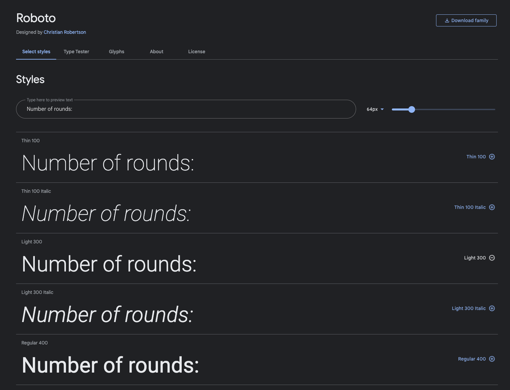

# **Memory of Queen Oblivion**
Memory of Queen Oblivion is a straight forward memory game where the user click on a card to see what image is underneath and then try to find the card that matches. The game targets people (more or less all ages) that wants to play a round of memory.

The game was created for Portfolio Project #2 (JavaScript) - Diploma in Full Stack Software Development Diploma at the [Code Institute](https://www.codeinstitute.net).

[View live website here](to be updated)

# Table of Content 

* [**Project**](<#project>)
    * [Site Users Goal](<#site-users-goal>)
    * [Site Owners Goal](<#site-owners-goal>)

* [**User Experience (UX)**](<#user-experience-ux>)
    * [Wireframes](<#wireframes>)
    * [Site Structure](<#site-structure>)
    * [Design Choices](<#design-choices>)

* [**Features**](<#features>)
    * [Navigation Bar](<#navigation-bar>)
    * [Hero Section](<#hero-section>)
    * [About Us Section](<#about-us-section>)
    * [Our Services Section](<#our-services-section>)
    * [Portfolio Section](<#portfolio-section>)
    * [Contact Section](<#contact-section>)
    * [Footer Section](<#footer-section>)
    * [Form Confirmation Page](<#form-confirmation-page>)

* [**Features Left To Implement**](<#features-left-to-implement>)

* [**Technologies Used**](<#technologies-used>)
    * [Languages](<#languages>)
    * [Frameworks, Librarys & Software](<#frameworks-libraries--software>)

* [**Testing**](<#testing>)
  * [Code Validation](<#code-validation>)
  * [Responsiveness Test](<#responsiveness-test>)
  * [Browser Compatibility](<#browser-compatibility>)
  * [Additional Testing](<#additional-testing>) 
  * [Known Bugs](<#known-bugs>)
* [Deployment](<#deployment>)
* [Credits](<#credits>)
* [Acknowledgements](<#acknowledgements>)

#   Project

## **Site Users Goal**
The users 
To be updated

## **Site Owners Goal**
To be updated

# User Experience (UX)

## Wireframes
The wireframes for the game 'Memory of Queen Oblivion' were created in the software [Balsamiq](https://balsamiq.com). The wireframes have been created for desktop, tablet and mobile devices. The text content wasn't finalized during the wireframe process. There are some visual visual differences compared to the wireframes, the reason being design choices that I made during the creation process.

## Site Structure
To be updated

[Back to top](<#table-of-content>)

# Design Choices

* ### Color Scheme
  The color scheme chosen for 'Memory of Queen Oblivion' was extracted from the background image for the game with the online service[Coolors](https://coolors.co/image-picker). The coolors are a mix of different shades of gray, Smoky black and a more red tone called Rosewood. Quite straight forward colors that all are in the darker spectrum of colors. Th reason why I chose a darker tone was because of the game story and game type. I wanted the feeling to be a little bit mysterious. Though the colors are quite dark there is still good readability and contrast. Kommentar: Lägg ev. in var färgerna använts.   
  

* ### Typography
  The fonts used for the game are 'Kaushan Script' and 'Roboto'. Fallback font for both of them is sans-serif. T

  * 'Kaushan Script' is a little bit harder to read than a regular font like Roboto but I wanted to use it because it fits the mysterious context better.

  * 'Roboto' was chosen for the score board to be easy to read with good contrast.

[Back to top](<#table-of-content>)