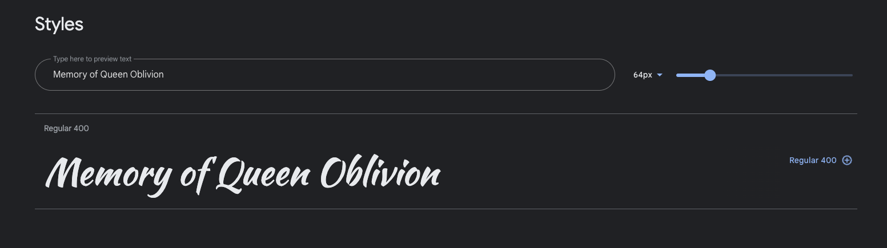

# **Memory of Queen Oblivion**
Memory of Queen Oblivion is a straight forward memory game where the user click on a card to see what image is underneath and then try to find the card that matches. The game targets people (more or less all ages) that wants to play a round of memory.

The game was created for Portfolio Project #2 (JavaScript) - Diploma in Full Stack Software Development Diploma at the [Code Institute](https://www.codeinstitute.net).

[View live website here](to be updated)

# Table of Content 

* [**Project**](<#project>)
    * [Site Users Goal](<#site-users-goal>)
    * [Site Owners Goal](<#site-owners-goal>)

* [**User Experience (UX)**](<#user-experience-ux>)
    * [Wireframes](<#wireframes>)
    * [Site Structure](<#site-structure>)
    * [Design Choices](<#design-choices>)

* [**Features**](<#features>)
    * [Navigation Bar](<#navigation-bar>)
    * [Hero Section](<#hero-section>)
    * [About Us Section](<#about-us-section>)
    * [Our Services Section](<#our-services-section>)
    * [Portfolio Section](<#portfolio-section>)
    * [Contact Section](<#contact-section>)
    * [Footer Section](<#footer-section>)
    * [Form Confirmation Page](<#form-confirmation-page>)

* [**Features Left To Implement**](<#features-left-to-implement>)

* [**Technologies Used**](<#technologies-used>)
    * [Languages](<#languages>)
    * [Frameworks, Librarys & Software](<#frameworks-libraries--software>)

* [**Testing**](<#testing>)
  * [Code Validation](<#code-validation>)
  * [Responsiveness Test](<#responsiveness-test>)
  * [Browser Compatibility](<#browser-compatibility>)
  * [Additional Testing](<#additional-testing>) 
  * [Known Bugs](<#known-bugs>)
* [Deployment](<#deployment>)
* [Credits](<#credits>)
* [Acknowledgements](<#acknowledgements>)

#   Project

## **Site Users Goal**
The users 
To be updated

## **Site Owners Goal**
To be updated

# User Experience (UX)

## Wireframes
The wireframes for the game 'Memory of Queen Oblivion' were created in the software [Balsamiq](https://balsamiq.com). The wireframes have been created for desktop, tablet and mobile devices. The text content wasn't finalized during the wireframe process. There are some visual visual differences compared to the wireframes, the reason being design choices that I made during the creation process.

## Site Structure
To be updated

[Back to top](<#table-of-content>)

# Design Choices

* ### Color Scheme
  The color scheme chosen for 'Memory of Queen Oblivion' was extracted from the background image for the game with the online service[Coolors](https://coolors.co/image-picker). The coolors are a mix of different shades of gray, Smoky black and a more red tone called Rosewood. Quite straight forward colors that all are in the darker spectrum of colors. Th reason why I chose a darker tone was because of the game story and game type. I wanted the feeling to be a little bit mysterious. Though the colors are quite dark there is still good readability and contrast.
  

* ### Typography
  The fonts used for the game are 'Kaushan Script' and 'Amatic SC'. Fallback font for both of them is sans-serif. T

  * 'Kaushan Script' is used for the game logo and the scoreboard. It is little bit harder to read than a more regular font like Amatic SC but I wanted to use it because it fits the mysterious / fairy-tale context better.

  * 'Amatic SC' was chosen for all the text besides the logo. It has a little bit of hand-written style to it which I really liked. It fits the game perfectly!

[Back to top](<#table-of-content>)

# **Features**
The features in the game are very straight forward. For me it was important with a intuitive interface that works the way the user expects it to. Some examples of features in the game are *choose difficulty level*, *toggle sound on/off*, *sound effects and animations to make it clear when user has clicked on the memory cards* and *possibility to always open start window from scoreboard menu*.

An intuitive interface is one that works the way the user expects it to. In other words, we find something intuitive when we don't have to think about it. Thinking, as anyone studying for an exam can tell you, is hard. It takes energy and attention. And thinking about two things at once is particularly difficult.3 feb. 2017
The features on the Creative Dreams website will help the users to understand what Creative Dreams offer and in an easy way initiate contact. General examples of features are *navigation bar*, *contact form*, *about section*, *our services section* and *examples of clients*.

## **Existing Features**

* ### Navigation Bar

  * The navigation section will help the user to, in an easy way, navigate on the page.

  * All sections on the site are gathered on the landing page (*index.html*) and the navigation bar, that is fully responsive, includes anchor links (with smooth scrolling) to *home*, *about*, *our services*, *portfolio* and *contact*.

  * The navigation is fixed / sticky and the menu items will stay highlighted after being clicked to make sure the user knows where they are on the site.
 
 

[Back to top](<#table-of-content>)
* ### Hero Section

  * The landing page includes a photograph with an overlay text box including an inspirational quote by Elizabeth Gilbert (*"A creative life is an amplified life, it's a bigger life, a happier life, an expanded life, and a hell of a lot more interesting life"*).

  * This section will get the users attention and inspire to learn more about Creative Dreams.

 

[Back to top](<#table-of-content>)
* ### About Us Section

  * The about section is an important part of a webpage and has descriptive information about a company. It will introduce the user to who Creative Dreams are, a high-end studio with one clear mission, *to deliver top quality recordings, mixing and mastering solutions* to the customers.

 

[Back to top](<#table-of-content>)
* ### Our Services Section

  * The Our Services Section will introduce the user to what services Creative Dreams offers (*recording*, *mixing*, *mastering* and *brainstorming*).

  * This section will make the user interested in Creative Dreams products and trigger them to learn more and initiate contact.

[Back to top](<#table-of-content>)