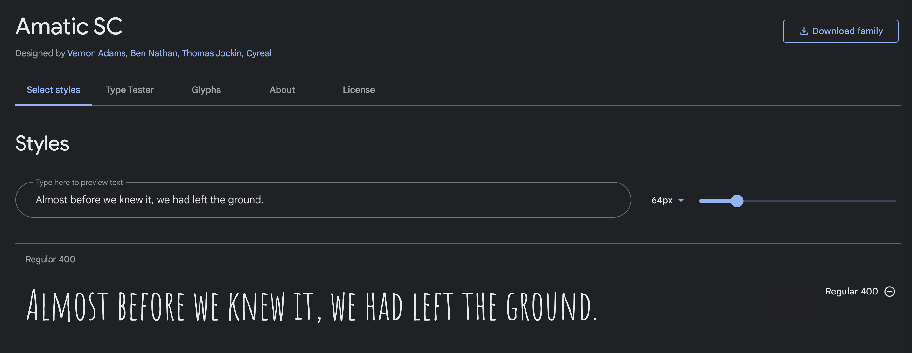
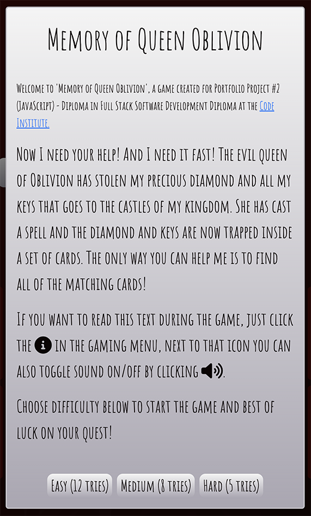
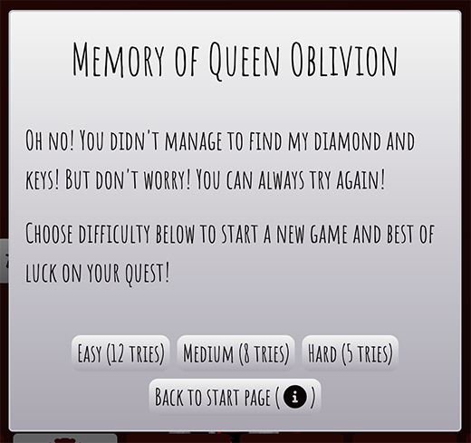

# **Memory of Queen Oblivion**
Memory of Queen Oblivion is a straight forward memory game where the user click on a card to see what image is underneath and then try to find the card that matches. The game targets people (more or less all ages) that wants to play a round of memory.

The game was created for Portfolio Project #2 (JavaScript) - Diploma in Full Stack Software Development Diploma at the [Code Institute](https://www.codeinstitute.net).

[View live website here](to be updated)

# Table of Content 

* [**Project**](<#project>)
    * [Site Users Goal](<#site-users-goal>)
    * [Site Owners Goal](<#site-owners-goal>)

* [**User Experience (UX)**](<#user-experience-ux>)
    * [Wireframes](<#wireframes>)
    * [Site Structure](<#site-structure>)
    * [Design Choices](<#design-choices>)

* [**Features**](<#features>)
    * [Navigation Bar](<#navigation-bar>)
    * [Hero Section](<#hero-section>)
    * [About Us Section](<#about-us-section>)
    * [Our Services Section](<#our-services-section>)
    * [Portfolio Section](<#portfolio-section>)
    * [Contact Section](<#contact-section>)
    * [Footer Section](<#footer-section>)
    * [Form Confirmation Page](<#form-confirmation-page>)

* [**Features Left To Implement**](<#features-left-to-implement>)

* [**Technologies Used**](<#technologies-used>)
    * [Languages](<#languages>)
    * [Frameworks, Librarys & Software](<#frameworks-libraries--software>)

* [**Testing**](<#testing>)
  * [Code Validation](<#code-validation>)
  * [Responsiveness Test](<#responsiveness-test>)
  * [Browser Compatibility](<#browser-compatibility>)
  * [Additional Testing](<#additional-testing>) 
  * [Known Bugs](<#known-bugs>)
* [Deployment](<#deployment>)
* [Credits](<#credits>)
* [Acknowledgements](<#acknowledgements>)

#   Project

## **Site Users Goal**
The users 
To be updated

## **Site Owners Goal**
To be updated

# User Experience (UX)

## Wireframes
The wireframes for the game 'Memory of Queen Oblivion' were created in the software [Balsamiq](https://balsamiq.com). The wireframes have been created for desktop, tablet and mobile devices. The text content wasn't finalized during the wireframe process. There are some visual visual differences compared to the wireframes, the reason being design choices that I made during the creation process.

## Site Structure
To be updated

[Back to top](<#table-of-content>)

# Design Choices

* ### Color Scheme
  The color scheme chosen for 'Memory of Queen Oblivion' was extracted from the background image for the game with the online service[Coolors](https://coolors.co/image-picker). The coolors are a mix of different shades of gray, Smoky black and a more red tone called Rosewood. Quite straight forward colors that all are in the darker spectrum of colors. Th reason why I chose a darker tone was because of the game story and game type. I wanted the feeling to be a little bit mysterious. Though the colors are quite dark there is still good readability and contrast.
  

* ### Typography
  The fonts used for the game are 'Kaushan Script' and 'Amatic SC'. Fallback font for both of them is sans-serif. T

  * 'Kaushan Script' is used for the game logo and the scoreboard. It is little bit harder to read than a more regular font like Amatic SC but I wanted to use it because it fits the mysterious / fairy-tale context better.

  * 'Amatic SC' was chosen for all the text besides the logo. It has a little bit of hand-written style to it which I really liked. It fits the game perfectly!

[Back to top](<#table-of-content>)

# **Features**
The features in the game are very straight forward. For me it was important with a intuitive interface that works the way the user expects it to. Some examples of features in the game are *choose difficulty level*, *toggle sound on/off*, *sound effects and animations to make it clear when user has clicked on the memory cards* and *possibility to always open start window from scoreboard menu*.

## **Existing Features**

* ### Logo Area

 

  * The logo area introduces the name of the game to the user.

[Back to top](<#table-of-content>)

* ### Scoreboard Area

 

  * The scoreboard area includes a points counter that adds +1 for every try to match card the user does. It also includes a tries left counter that subtracts -1 for every failed matching of cards. The initial value of the tries left counter is connected to the users choice of difficulty in the modal windows (see [modals](<#modals>) below). The different difficultys are: *easy: 12 tries*, *medium: 8 tries*, *hard: 5 tries*.
  
  * The scoreboard area also includes two clickable buttons, one *information button* and one *sound toggle on/off button*

  * This scoreboard area will help the user to get updated about the game round and also get the possibility to re-visit the start screen through the information button and also turn on/off the sound in the game.

[Back to top](<#table-of-content>)

* ### Game Area

 

  * The game area is the area the user have the most interaction with. It consists of 12 memory cards that are clickable. The user needs to click two cards after each other to see if they match. When the user clicks a card a flip animation is triggered. If the cards match they stay flipped but if the don't match they flip back. If the user has no tries left the *game over modal* will open and if the user finds all matching cards the *congratulations modal will open*.

  * There are also sound effects playing when the user *clicks the card*, *no match*, *match*, *game over* and *congratulations*.

[Back to top](<#table-of-content>)

* ### Modals

  * The modals (*welcome and information modal*, *game over modal*, *congratulations modal*) in this game are important. It is in the modals the user gets information about the game and also have the possibility to choose difficulty level.

    * The welcome and information modal pops when the game starts. It includes all the information the user needs to play the game (*backstory of the game*, *explanation of rules*, and *choice of difficulty*)
    
    

    * The information modal that pops when the user clicks the *i* icon in the scoreboard menu is the same as the welcome modal besides one added *back to game* button if the user doesn't want to restart the game.

    
    
    * Game Over Modal
    
    
    
    * Congratulations Modal
    
    

[Back to top](<#table-of-content>)

    