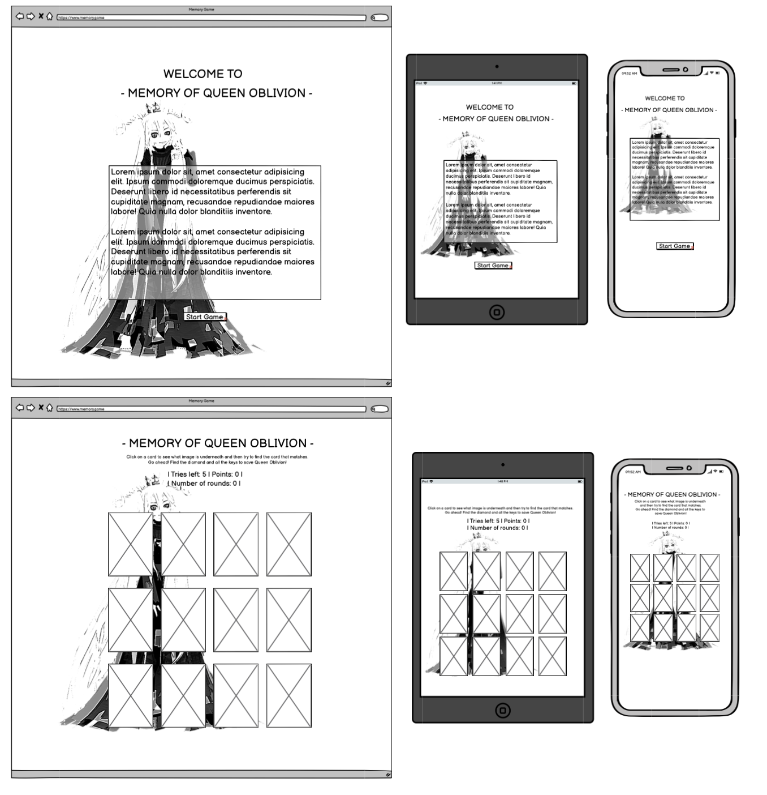
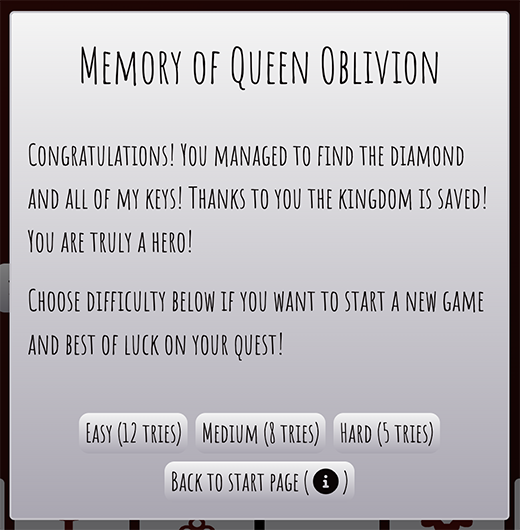
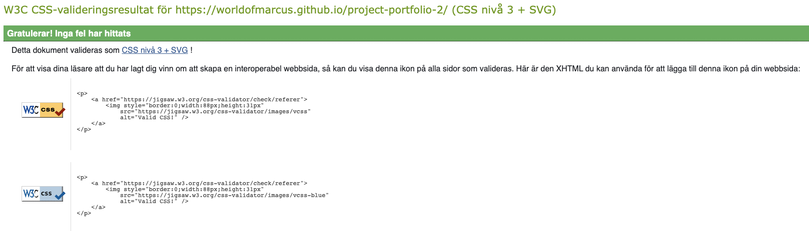

# **Memory of Queen Oblivion**
Memory of Queen Oblivion is a straight forward memory game where the user click on a card to see what image is underneath and then try to find the card that matches. The game targets people (more or less all ages) that wants to play a round of memory.

The game was created for Portfolio Project #2 (JavaScript) - Diploma in Full Stack Software Development Diploma at the [Code Institute](https://www.codeinstitute.net).

[View live website here](to be updated)

# Table of Content 

* [**Project**](<#project>)
    * [Site Users Goal](<#site-users-goal>)
    * [Site Owners Goal](<#site-owners-goal>)

* [**User Experience (UX)**](<#user-experience-ux>)
    * [Wireframes](<#wireframes>)
    * [Site Structure](<#site-structure>)
    * [Design Choices](<#design-choices>)

* [**Features**](<#features>)
    * [Navigation Bar](<#navigation-bar>)
    * [Hero Section](<#hero-section>)
    * [About Us Section](<#about-us-section>)
    * [Our Services Section](<#our-services-section>)
    * [Portfolio Section](<#portfolio-section>)
    * [Contact Section](<#contact-section>)
    * [Footer Section](<#footer-section>)
    * [Form Confirmation Page](<#form-confirmation-page>)

* [**Features Left To Implement**](<#features-left-to-implement>)

* [**Technologies Used**](<#technologies-used>)
    * [Languages](<#languages>)
    * [Frameworks, Librarys & Software](<#frameworks-libraries--software>)

* [**Testing**](<#testing>)
  * [Code Validation](<#code-validation>)
  * [Responsiveness Test](<#responsiveness-test>)
  * [Browser Compatibility](<#browser-compatibility>)
  * [Additional Testing](<#additional-testing>) 
  * [Known Bugs](<#known-bugs>)
* [Deployment](<#deployment>)
* [Credits](<#credits>)
* [Acknowledgements](<#acknowledgements>)

#   Project

## **Site Users Goal**
The users 
To be updated

## **Site Owners Goal**
To be updated

# User Experience (UX)

## Wireframes
The wireframes for the game 'Memory of Queen Oblivion' were created in the software [Balsamiq](https://balsamiq.com). The wireframes have been created for desktop, tablet and mobile devices. The text content wasn't finalized during the wireframe process. There are some visual visual differences compared to the wireframes, the reason being design choices that I made during the creation process.

## Site Structure
To be updated

[Back to top](<#table-of-content>)

# Design Choices

* ### Color Scheme
  The color scheme chosen for 'Memory of Queen Oblivion' was extracted from the background image for the game with the online service[Coolors](https://coolors.co/image-picker). The coolors are a mix of different shades of gray, Smoky black and a more red tone called Rosewood. Quite straight forward colors that all are in the darker spectrum of colors. Th reason why I chose a darker tone was because of the game story and game type. I wanted the feeling to be a little bit mysterious. Though the colors are quite dark there is still good readability and contrast.
  

* ### Typography
  The fonts used for the game are 'Kaushan Script' and 'Amatic SC'. Fallback font for both of them is sans-serif. T

  * 'Kaushan Script' is used for the game logo and the scoreboard. It is little bit harder to read than a more regular font like Amatic SC but I wanted to use it because it fits the mysterious / fairy-tale context better.

  * 'Amatic SC' was chosen for all the text besides the logo. It has a little bit of hand-written style to it which I really liked. It fits the game perfectly!

[Back to top](<#table-of-content>)

# **Features**
The features in the game are very straight forward. For me it was important with a intuitive interface that works the way the user expects it to. Some examples of features in the game are *choose difficulty level*, *toggle sound on/off*, *sound effects and animations to make it clear when user has clicked on the memory cards* and *possibility to always open start window from scoreboard menu*.

## **Existing Features**

* ### Logo Area

 

  * The logo area introduces the name of the game to the user.

[Back to top](<#table-of-content>)

* ### Scoreboard Area

 

  * The scoreboard area includes a points counter that adds +1 for every try to match card the user does. It also includes a tries left counter that subtracts -1 for every failed matching of cards. The initial value of the tries left counter is connected to the users choice of difficulty in the modal windows (see [modals](<#modals>) below). The different difficultys are: *easy: 12 tries*, *medium: 8 tries*, *hard: 5 tries*.
  
  * The scoreboard area also includes two clickable buttons, one *information button* and one *sound toggle on/off button*

  * This scoreboard area will help the user to get updated about the game round and also get the possibility to re-visit the start screen through the information button and also turn on/off the sound in the game.

[Back to top](<#table-of-content>)

* ### Game Area

 

  * The game area is the area the user have the most interaction with. It consists of 12 memory cards that are clickable. The user needs to click two cards after each other to see if they match. When the user clicks a card a flip animation is triggered. If the cards match they stay flipped but if the don't match they flip back. If the user has no tries left the *game over modal* will open and if the user finds all matching cards the *congratulations modal will open*.

  * There are also sound effects playing when the user *clicks the card*, *no match*, *match*, *game over* and *congratulations*.

[Back to top](<#table-of-content>)

* ### Modals

  * The modals (*welcome and information modal*, *game over modal*, *congratulations modal*) in this game are important. It is in the modals the user gets information about the game and also have the possibility to choose difficulty level.

  * The welcome and information modal pops when the game starts. It includes all the information the user needs to play the game (*backstory of the game*, *explanation of rules*, and *choice of difficulty*)
  
  

  * The information modal that pops when the user clicks the *i* icon in the scoreboard menu is the same as the welcome modal besides one added *back to game* button if the user doesn't want to restart the game.

  
  
  * The game over modal gives the user information about loosing the game but also gives the user the possibility to try again by pressing one of the difficulty level buttons.
  
  
  
  * The congratulations modal gives the user the information that they have completed the game but also gets the possibility to try again by pressing one of the difficulty level buttons.
  
  

[Back to top](<#table-of-content>)

### Features Left to Implement

* Add two player mode
* Upgrade design / graphics with more animations
* Add background music

[Back to top](<#table-of-content>)

# Technologies Used

## Languages

* [JavaScript](https://www.javascript.com/) - provides the biggest part of the functionality for the application.
* [HTML5](https://html.spec.whatwg.org/) - provides the content and structure for the application.
* [CSS3](https://www.w3.org/Style/CSS/Overview.en.html) - provides the styling for the application.

## Frameworks, Libraries & Software

* [Adobe Photoshop](https://www.adobe.com/se/products/photoshop.html) - used to manipulate the background image and to create the memory cards.
* [Am I Responsive](https://ui.dev/amiresponsive) - used to create presentation of responsive design.
* [Balsamiq](https://balsamiq.com/wireframes/) - used to create the wireframes.
* [Coolors](https://coolors.co/) - used to extract colors from background image as foundation for color palette.
* [Convertio](https://convertio.co/jpg-webp/) - used to convert png to webp.
* [Font Awesome:](https://fontawesome.com/) - used to import icons to the website.
* [Github](https://github.com/) - used to host and edit the website.
* [Gitpod](https://www.gitpod.io/#get-started) - used to deploy the website.
* [Google Chrome DevTools](https://developer.chrome.com/docs/devtools/) - used to test website.
* [Google Fonts](https://fonts.google.com/) - used to import fonts to the website.
* [Bootstrap](https://getbootstrap.com/) - used for modals in game
* [Lighthouse](https://developer.chrome.com/docs/lighthouse/overview/) - used to test performance of site.
* [Responsive Design Checker](https://www.responsivedesignchecker.com/) - used for responsiveness check.
* [Wave Web Accessibility Evaluation Tool](https://wave.webaim.org/) - used to validate the sites accessibility.
* [Pixabay](https://pixabay.com/users/irinairinafomicheva-25140203/?utm_source=link-attribution&amp;utm_medium=referral&amp;utm_campaign=music&amp;utm_content=13692") - 'Stop sound' used when user clicks card. Sound made by user 'irinairinafomicheva'
* [Zapsplat](https://www.zapsplat.com/sound-effect-packs/) - 'No match'-sound, 'Match'-sound, 'Game Over-sound', 'Congratulations-sound' taken from the free Zapsplat sound packs 'Retro Game Musical Tones' and 'Notification Bells'

[Back to top](<#table-of-content>)

# Testing

## Code Validation
The 'Memory of Queen Oblivion'-application has been tested through both [W3C html Validator](https://validator.w3.org/), [W3C CSS Validator](https://jigsaw.w3.org/css-validator/) and [JSHint](https://jshint.com/). Errors were found on index.html but could quite easily be fixed (see [bugs section](#known-bugs)).

### HTML Validator
The HTML validator results for each page, after fixing the minor errors can be seen below:

* Home Page

No errors were returned when passing through the official W3C validator.

* Form Confirmation page

No errors were returned when passing through the official W3C validator.

[Back to top](<#table-of-content>)
### CSS Validator
The CSS validator results can be seen below:

No errors were returned when passing through the official W3C validator.

[Back to top](<#table-of-content>)
# Responsiveness Test

The responsive design tests were carried out manually with [Google Chrome DevTools](https://developer.chrome.com/docs/devtools/) and [Responsive Design Checker](https://www.responsivedesignchecker.com/).

| Desktop    | Display <1280px       | Display >1280px    |
|------------|-----------------------|--------------------|
| Render     | pass                  | pass               | 
| Images     | pass                  | pass               | 
| Links      | pass                  | pass               |

| Tablet     | Samsung Galaxy Tab 10 | Amazon Kindle Fire | iPad Mini | iPad Pro |
|------------|-----------------------|--------------------|-----------|----------|
| Render     | pass                  | pass               | pass      | pass     | 
| Images     | pass                  | pass               | pass      | pass     | 
| Links      | pass                  | pass               | pass      | pass     | 

| Phone      | Galaxy S5/S6/S7       | iPhone 6/7/8       | iPhone 12pro         |
|------------|-----------------------|--------------------|----------------------|
| Render     | pass                  | pass               | pass      | pass     | 
| Images.    | pass                  | pass               | pass      | pass     | 
| Links      | pass                  | pass               | pass      | pass     | 

*Comment: To keep the design together on wider screens the content of the site is restricted to 1280px.*

[Back to top](<#table-of-content>)
## Browser Compatibility

Creative Dreams website was tested for responsiveness, functionality and appearance in the following browsers on desktop, tablet and phone with no visible issues for the user. 

* Google Chrome Version (103.0.5060.114)
* Mozilla Firefox (version 102.0.1)
* Min (version 1.25.1)
* Apple Safari (version 15.5)
* Microsoft Edge (version 103.0.1264.62)

[Back to top](<#table-of-content>)
## Additional Testing

### WAVE

[WAVE](https://wave.webaim.org/) was used to check accessibility. 0 errors and 31 alerts was found. 17 of the alerts were connected to justified text which in the context isn't a critical issue. The rest of the alerts were connected to the video/audio (*lack of synchronized captions and transcripts*) which isn't critical in this context.

[Back to top](<#table-of-content>)

### Lighthouse
[Google Lighthouse](https://developers.google.com/web/tools/lighthouse) in Chrome Developer Tools was used to test the website for *Performance*, *Accessibility*, *Best Practices* and *SEO*. The testing showed that the *Accessability*, *Best Practices* and *SEO* was 100%. The Performance fluctuated between 83 and 90. The main reason for the decreased performance is the audio/video clips on the site (*and to some extent the hero image*) even after compression.

**Lighthouse result Main Page**

**Lighthouse result Form Confirmation Page**

[Back to top](<#table-of-content>)

### Peer Review
Additional testing of the site was conducted mainly by people outside of the software development field. Some spelling and grammar errors were found and corrected. In general there were no challenges with the design.
