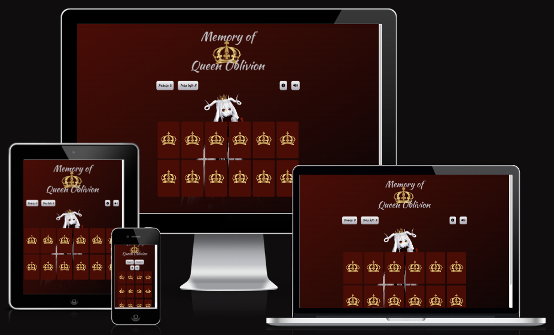
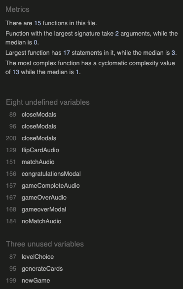
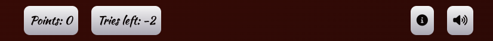

# **Memory of Queen Oblivion**
Memory of Queen Oblivion is a straight forward memory game where the user click on a card to see what image is underneath and then try to find the card that matches. The game was created to target users of all ages and has implemented functions like sound and animations to engage the user. The game is quite difficult why the game offers different choices of difficulty which will engage the user for a longer period of time.

The game was created for Portfolio Project #2 (JavaScript) - Diploma in Full Stack Software Development Diploma at the [Code Institute](https://www.codeinstitute.net).

[View live website here](https://worldofmarcus.github.io/project-portfolio-2/)

# Table of Content 

* [**Project**](<#project>)
    * [Site Users Goal](<#site-users-goal>)
    * [Site Owners Goal](<#site-owners-goal>)

* [**User Experience (UX)**](<#user-experience-ux>)
    * [Wireframes](<#wireframes>)
    * [Site Structure](<#site-structure>)
    * [Design Choices](<#design-choices>)

* [**Features**](<#features>)
    * [Logo Area](<#logo-area>)
    * [Scoreboard Area](<#scoreboard-area>)
    * [Game Area](<#game-area>)
    * [Modals](<#modals>)

* [**Features Left To Implement**](<#features-left-to-implement>)

* [**Technologies Used**](<#technologies-used>)
    * [Languages](<#languages>)
    * [Frameworks, Librarys & Software](<#frameworks-libraries--software>)

* [**Testing**](<#testing>)
  * [Code Validation](<#code-validation>)
  * [Responsiveness Test](<#responsiveness-test>)
  * [Browser Compatibility](<#browser-compatibility>)
  * [Additional Testing](<#additional-testing>) 
  * [Known Bugs](<#known-bugs>)
* [Deployment](<#deployment>)
* [Credits](<#credits>)
* [Acknowledgements](<#acknowledgements>)

#   Project

## **Site Users Goal**
The user of 'Memory of Queen Oblivion' wants to play a fun round of memory that is intuitive, has a nice visual design and is quite challenging.

## **Site Owners Goal**
The goal of the site is to spread joy to users in all ages by delivering a memory game with an intuitive interface and nice visual- an sound design.

[Back to top](<#table-of-content>)

# User Experience (UX)

## Wireframes
The wireframes for the game 'Memory of Queen Oblivion' were created in the software [Balsamiq](https://balsamiq.com). The wireframes have been created for desktop, tablet and mobile devices. The text content wasn't finalized during the wireframe process. There are some visual visual differences compared to the wireframes, the reason being design choices that I made during the creation process.

## Site Structure
The 'Memory of Queen Oblivion' application has four different type of areas (see links below). *Logo area* in the top, *Score board area*, *Game Area* and the different *Modals* that is being shown depending on where in the game the user is. Read more about each part by following the links below.

* [Logo Area](<#logo-area>)
* [Scoreboard Area](<#scoreboard-area>) 
* [Game Area](<#game-area>)
* [Modals Area](<#modals>) 

# Design Choices

* ### Color Scheme
  The color scheme chosen for 'Memory of Queen Oblivion' was extracted from the background image for the game with the online service[Coolors](https://coolors.co/image-picker). The coolors are a mix of different shades of gray, Smoky black and a more red tone called Rosewood. Quite straight forward colors that all are in the darker spectrum of colors. Th reason why I chose a darker tone was because of the game story and game type. I wanted the feeling to be a little bit mysterious. Though the colors are quite dark there is still good readability and contrast.
  

* ### Typography
  The fonts used for the game are 'Kaushan Script' and 'Amatic SC'. Fallback font for both of them is sans-serif.

  * 'Kaushan Script' is used for the game logo and the scoreboard. It is little bit harder to read than a more regular font like Amatic SC but I wanted to use it because it fits the mysterious / fairy-tale context better.

  * 'Amatic SC' was chosen for all the text besides the logo. It has a little bit of hand-written style to it which I really liked. It fits the game perfectly!

[Back to top](<#table-of-content>)

# **Features**
The features in the game are very straight forward. For me it was important with a intuitive interface that works the way the user expects it to. Some examples of features in the game are *choose difficulty level*, *toggle sound on/off*, *sound effects and animations to make it clear when user has clicked on the memory cards* and *possibility to always open start window from scoreboard menu*.

## **Existing Features**

* ### Logo Area

 

  * The logo area introduces the name of the game to the user.

[Back to top](<#table-of-content>)

* ### Scoreboard Area

 

  * The scoreboard area includes a points counter that adds +1 for every try to match card the user does. It also includes a tries left counter that subtracts -1 for every failed matching of cards. The initial value of the tries left counter is connected to the users choice of difficulty in the modal windows (see [modals](<#modals>) below). The different difficultys are: *easy: 12 tries*, *medium: 8 tries*, *hard: 5 tries*.
  
  * The scoreboard area also includes two clickable buttons, one *information button* and one *sound toggle on/off button*

  * This scoreboard area will help the user to get updated about the game round and also get the possibility to re-visit the start screen through the information button and also turn on/off the sound in the game.

[Back to top](<#table-of-content>)

* ### Game Area

 

  * The game area is the area the user have the most interaction with. It consists of 12 memory cards that are clickable. The user needs to click two cards after each other to see if they match. When the user clicks a card a flip animation is triggered. If the cards match they stay flipped but if the don't match they flip back. If the user has no tries left the *game over modal* will open and if the user finds all matching cards the *congratulations modal will open*.

  * After each round or when the user starts a new game the cards are randomized so that the images isn't on the same location every round.

  * There are also sound effects playing when the user *clicks the card*, *no match*, *match*, *game over* and *congratulations*.

[Back to top](<#table-of-content>)

* ### Modals

  * The modals (*welcome and information modal*, *game over modal*, *congratulations modal*) in this game are important. It is in the modals the user gets information about the game and also have the possibility to choose difficulty level.

  * The welcome and information modal pops when the game starts. It includes all the information the user needs to play the game (*backstory of the game*, *explanation of rules*, and *choice of difficulty*)
  
  

  * The information modal that pops when the user clicks the *i* icon in the scoreboard menu is the same as the welcome modal besides one added *back to game* button if the user doesn't want to restart the game.

  
  
  * The game over modal gives the user information about loosing the game but also gives the user the possibility to try again by pressing one of the difficulty level buttons.
  
  
  
  * The congratulations modal gives the user the information that they have completed the game but also gets the possibility to try again by pressing one of the difficulty level buttons.
  
  

[Back to top](<#table-of-content>)

### Features Left to Implement

* Add two player mode
* Upgrade design / graphics with more animations and cleaner look
* Add background music

[Back to top](<#table-of-content>)

# Technologies Used

## Languages

* [JavaScript](https://www.javascript.com/) - provides the biggest part of the functionality for the application.
* [HTML5](https://html.spec.whatwg.org/) - provides the content and structure for the application.
* [CSS3](https://www.w3.org/Style/CSS/Overview.en.html) - provides the styling for the application.

## Frameworks, Libraries & Software

* [Adobe Photoshop](https://www.adobe.com/se/products/photoshop.html) - used to manipulate the background image and to create the memory cards.
* [Am I Responsive](https://ui.dev/amiresponsive) - used to create presentation of responsive design.
* [Balsamiq](https://balsamiq.com/wireframes/) - used to create the wireframes.
* [Bootstrap](https://getbootstrap.com/) - used for modals in game
* [Coolors](https://coolors.co/) - used to extract colors from background image as foundation for color palette.
* [Convertio](https://convertio.co/jpg-webp/) - used to convert png to webp.
* [Font Awesome:](https://fontawesome.com/) - used to import icons to the website.
* [Github](https://github.com/) - used to host and edit the website.
* [Gitpod](https://www.gitpod.io/#get-started) - used to deploy the website.
* [Google Chrome DevTools](https://developer.chrome.com/docs/devtools/) - used to test website.
* [Google Fonts](https://fonts.google.com/) - used to import fonts to the website.
* [Lighthouse](https://developer.chrome.com/docs/lighthouse/overview/) - used to test performance of site.
* [Pixabay](https://pixabay.com/users/irinairinafomicheva-25140203/?utm_source=link-attribution&amp;utm_medium=referral&amp;utm_campaign=music&amp;utm_content=13692") - 'Stop sound' used when user clicks card. Sound made by user 'irinairinafomicheva'
* [Responsive Design Checker](https://www.responsivedesignchecker.com/) - used for responsiveness check.
* [Wave Web Accessibility Evaluation Tool](https://wave.webaim.org/) - used to validate the sites accessibility.
* [Zapsplat](https://www.zapsplat.com/sound-effect-packs/) - 'No match'-sound, 'Match'-sound, 'Game Over-sound', 'Congratulations-sound' taken from the free Zapsplat sound packs 'Retro Game Musical Tones' and 'Notification Bells'

[Back to top](<#table-of-content>)

# Testing

## Code Validation
The 'Memory of Queen Oblivion'-application has been tested through both [W3C html Validator](https://validator.w3.org/), [W3C CSS Validator](https://jigsaw.w3.org/css-validator/) and [JSHint](https://jshint.com/). Errors were found on index.html but could quite easily be fixed (see [bugs section](#known-bugs)).

### HTML Validator
The HTML validator results for each page, after fixing the minor errors can be seen below:

* Home Page

No errors were returned when passing through the official W3C validator.

[Back to top](<#table-of-content>)

### CSS Validator
The CSS validator results can be seen below:

No errors were returned when passing through the official W3C validator.

[Back to top](<#table-of-content>)

### JSHint
The JSHint validator results can be seen below:

No errors were returned when passing through JSHint (*script.js*, *audio.js*, *modals.js*) but all tests reported issues connected to unused and undefined variables. These issues are not valid as the variables are used in other JavaScript files.

* script.js

* audio.js

* modals.js

[Back to top](<#table-of-content>)

# Responsiveness Test

The responsive design tests were carried out manually with [Google Chrome DevTools](https://developer.chrome.com/docs/devtools/) and [Responsive Design Checker](https://www.responsivedesignchecker.com/).

| Desktop    | Display <1280px       | Display >1280px    |
|------------|-----------------------|--------------------|
| Render     | pass                  | pass               | 
| Images     | pass                  | pass               | 
| Links      | pass                  | pass               |

| Tablet     | Samsung Galaxy Tab 10 | Amazon Kindle Fire | iPad Mini | iPad Pro |
|------------|-----------------------|--------------------|-----------|----------|
| Render     | pass                  | pass               | pass      | pass     | 
| Images     | pass                  | pass               | pass      | pass     | 
| Links      | pass                  | pass               | pass      | pass     | 

| Phone      | Galaxy S5/S6/S7       | iPhone 6/7/8       | iPhone 12pro         |
|------------|-----------------------|--------------------|----------------------|
| Render     | pass                  | pass               | pass      | pass     | 
| Images.    | pass                  | pass               | pass      | pass     | 
| Links      | pass                  | pass               | pass      | pass     | 

*Comment: To keep the design together on wider screens the content of the site is restricted to 1280px.*

[Back to top](<#table-of-content>)

## Browser Compatibility

Creative Dreams website was tested for responsiveness, functionality and appearance in the following browsers on desktop, tablet and phone with no visible issues for the user. 

* Google Chrome Version (103.0.5060.114)
* Mozilla Firefox (version 102.0.1)
* Min (version 1.25.1)
* Apple Safari (version 15.5)
* Microsoft Edge (version 103.0.1264.62)

[Back to top](<#table-of-content>)
## Additional Testing

### WAVE

[WAVE](https://wave.webaim.org/) was used to check accessibility. 0 errors and 2 alerts was found. The first alert was connected to a warning of redundant links (but they are in different modals so it's not an issue). The second alert was connected to the page lacks a h1 (which is not a problem because the game has a headline image).

[Back to top](<#table-of-content>)

### Lighthouse
[Google Lighthouse](https://developers.google.com/web/tools/lighthouse) in Chrome Developer Tools was used to test the application within the areas of *Performance*, *Accessibility*, *Best Practices* and *SEO*. The testing showed that the *Accessability*, *Best Practices* and *SEO* was 100%. The Performance fluctuated between 75 and 90. To handle this I first compressed the *.png files and then also converted them to *.webp. After that i managed to squeeze the performance up to 88. I think the performance also ias affected by the external scripts (connected to i.e. Bootstrap).

[Back to top](<#table-of-content>)

### Peer Review
Additional testing of the application was conducted by people outside of the software development field. Some spelling and grammar errors were found and corrected. No issues connected to gaming experiences and visual design was reported.

## Known bugs

### Fixed Bugs

**2022-08-05**
* Bug: During the mid project session with my mentor Precious an error was being generated in the console. The bug was connected to a missing Favicon and was easily fixed by adding correct Favicon images.

**2022-08-08**
* Bug: During the HTML-validation 13 warnings and 12 errors were reported from the validator. 3 warnings was connected to no h1 in document and use of sections. This was fixed by changing the sections do divs. The rest of the warnings and errors was connected to a mistake with duplicate id:s in the modal code. That was very easy to fix and when the page was re-run in the validator no errors were returned.

### Unfixed Bugs
**2022-08-08**
* Bug: When clicking outside of the 'Game Over'-modal the reset of the game doesn't work which mean that the 'Number of tries' continue to subtract even if the user has 0 tries left. See screenshot below. This is something that can be fixed by setting the modal backdrop to static. This isn't a critical bug and due to coming deadline for this project I will leave it unfixed for now.

[Back to top](<#table-of-content>)
# Deployment

## To Deploy The Project
The site was deployed to GitHub pages. The steps to deploy are as follows:

1. In the GitHub repository, navigate to the Settings tab

[Back to top](<#table-of-content>)

2. Go to the Pages link in the left menu

[Back to top](<#table-of-content>)

3. From the source section drop-down menu, select the main branch (can be master in some cases but for me it was main)

4. Once the main branch has been selected, the page will be automatically refreshed and information about successful deployment / publishing can be seen on screen. The live link can be found [here](https://worldofmarcus.github.io/project-portfolio-1/index.html).

[Back to top](<#table-of-content>)

## How To Fork The Repository On GitHub

It is possible to do a copy of a GitHub Repository by forking the GitHub account. The copy can then be viewed and it is also possible to do changes in the copy without affecting the original repository. To fork the repository, take these steps:

1. After logging in to GitHub, locate the repository. On the top right side of the page there is a 'Fork' button. Click on the button to create a copy of the original repository.

[Back to top](<#table-of-content>)

## Create A Local Clone of A Project

To create a local clone of your repository, follow these steps:

1. When you are in the repository, find the code tab and click it.
2. To the left of the green GitPod button, press the 'code' menu. There you will find a link to the repository. Click on the clipboard icon to copy the URL.
3. Use an IDE and open Git Bash. Change directory to the location where you want the cloned directory to be made.
4. Type 'git clone', and then paste the URL that you copied from GitHub. Press enter and a local clone will be created.

[Back to top](<#table-of-content>)

# Credits

## Content

* All text content written by Marcus Eriksson.

* All the icons on the website were taken from [Font Awesome](https://fontawesome.com/).

* [Template](https://github.com/Code-Institute-Solutions/readme-template) for read.me provided by Code Institute (*with some additional changes that my mentor [Precious Ijege](https://www.linkedin.com/in/precious-ijege-908a00168/))* suggested.

## Technical

* General tips and tricks during the project was taken from [W3C Schools](https://www.w3schools.com/).

* Code inspiration for memory game from [Marina Ferreira](https://marina-ferreira.github.io/tutorials/js/memory-game) and [DevelopedByEd](https://youtu.be/-tlb4tv4mC4).

* Box Shadow inspiration taken from [CSS Scan](https://getcssscan.com/css-box-shadow-examples).

* Shuffle card array function taken from [JavaScript.info](https://javascript.info/task/shuffle).

* A lot of reading and experimenting needed to implement [Bootstrap](https://getbootstrap.com/docs/5.2/getting-started/introduction/) functions.

* onLoad modal function taken from [Stack Overflow](https://stackoverflow.com/questions/10233550/launch-bootstrap-modal-on-page-load).

## Media

* Game background image taken from [FAVPNG](https://favpng.com/png_view/queen-the-evil-queen-female-png/hT1QGRsj) - Used as background in the game area.

* Card images (keys) taken from [FAVPNG](https://favpng.com/png_view/vector-lovely-pattern-retro-flat-key-key-photography-clip-art-png/C5YqV8Y7) - Used as card fronts.

* Crown image taken from [FAVPNG](https://favpng.com/png_view/vector-hand-painted-gold-crown-crown-png/8D2v2jT8) - Used as back of the card and in the game logo.

* Diamond card image taken from [FAVPNG](https://favpng.com/png_view/diamond-gem-clip-art-free-diamond-art-gemstone-png/T1mJvqry) - Used as one of the card fronts.

* Click card sound taken from [Pixabay](https://pixabay.com/users/irinairinafomicheva-25140203/?utm_source=link-attribution&amp;utm_medium=referral&amp;utm_campaign=music&amp;utm_content=13692") - 'Stop sound' used when user clicks card. Sound made by user 'irinairinafomicheva'

* All other sounds taken from [Zapsplat](https://www.zapsplat.com/sound-effect-packs/) - 'No match'-sound, 'Match'-sound, 'Game Over-sound', 'Congratulations-sound' taken from the free Zapsplat sound packs 'Retro Game Musical Tones' and 'Notification Bells'

[Back to top](<#table-of-content>)

# Acknowledgements
The 'Memory of Queen Oblivion' game was completed as the Portfolio Project #2 (*JavaScript*) for the Full Stack Software Development Diploma at the [Code Institute](https://codeinstitute.net/). I would like to thank my mentor [Precious Ijege](https://www.linkedin.com/in/precious-ijege-908a00168/) for relevant feedback during the project.

*Marcus Eriksson 2022-08-08.*

[Back to top](<#table-of-content>)